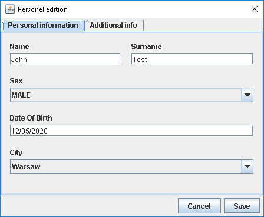
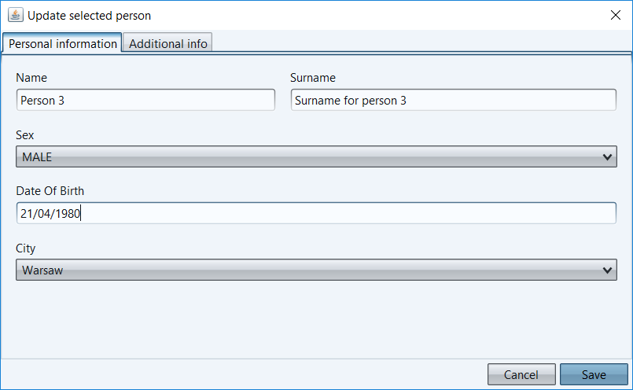
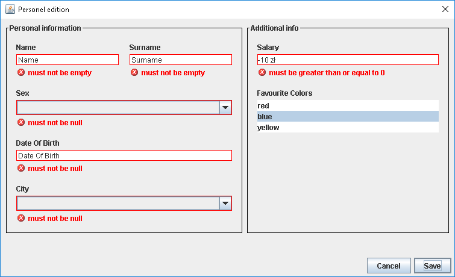
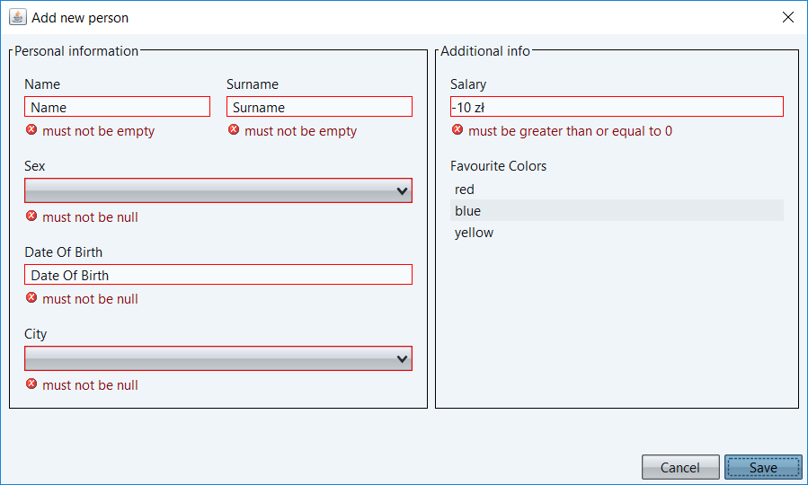
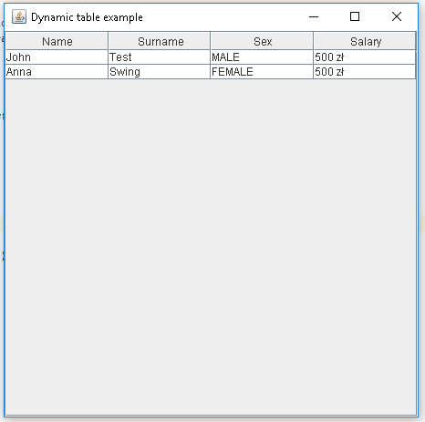
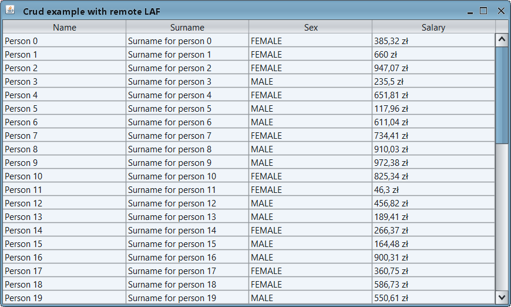

# swing-dynamic-gui

This is a library providing easy and customisable way of building GUI in Java Swing applications utilizing forms and tables generation based on config via both annotations and code.

## Dynamic forms
| Default SWING LAF  |  Substance LAF |
|---|---|
|   |   |
|  |   |
## Dynamic tables
|  SWING LAF | Substance LAF   |
|---|---|
|   |   |

# How to start
## Check provided examples
In order to run attached examples please download/clone repository, execute `mvn install` and then just run the chosen example.
### model package
This package consists of java POJOs used in forms
### simple package
This package includes the simplest examples of using lib. You can check `FormExampleApp` to visualize generated form and `TableExampleApp`
 to check how to create dynamic table
### crud package
This package provides an example how to can use lib in CRUD like app and how to laod data asynchronously outside the event dispatch thread. Moreover this example use one of the Look And Feels provided by Substance. Check it to get best UI with SWING.
## Check wiki [here](https://github.com/damianfraszczak/swing-dynamic-gui/wiki)
1. [Custom forms](https://github.com/damianfraszczak/swing-dynamic-gui/wiki/1.-Custom-forms)
    1. [Forms configuration options](https://github.com/damianfraszczak/swing-dynamic-gui/wiki/1.1.-Forms-configuration-options)
    2. [Custom validation options](https://github.com/damianfraszczak/swing-dynamic-gui/wiki/1.2.-Custom-validation-options)
2. [Custom tables](https://github.com/damianfraszczak/swing-dynamic-gui/wiki/2.-Custom-tables)
    1. [Tables configuration options](https://github.com/damianfraszczak/swing-dynamic-gui/wiki/2.1.-Tables-configuration-options)
## Check javadoc - [here](https://javadoc.jitpack.io/com/github/damianfraszczak/swing-dynamic-gui/swing-dynamic-gui/687c8316eb/javadoc/)
